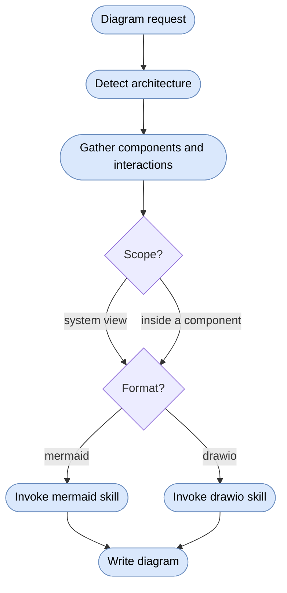

# Diagrams Skill

Routes architecture overview diagram requests: detects the architecture, gathers components and interactions, asks scope and format, then delegates rendering to the `mermaid` or `drawio` skill.

## When To Use

Use this skill when the user asks for architecture overviews, component interaction diagrams, subsystem diagrams, layer diagrams, feature maps, service interaction diagrams, system landscapes, or integration maps. Not for detailed class diagrams or sequence diagrams.

## Workflow

## Architecture Detection

1. The user names it explicitly ("BCE diagram", "layered view", "feature map").
2. `AGENTS.md` `## SDD4J` declares an `sdd4j-*` architecture adapter.
3. Codebase scan (per-architecture patterns below).
4. Still ambiguous — asked as part of the scope/format question.

| Architecture | Detection signals |
|---|---|
| BCE | `[org].[project].[bc].[boundary|control|entity]` packages; `sdd4j-bce` |
| Package By Layer | global `controller`/`service`/`repository`/`model` roots; `sdd4j-package-by-layer` |
| Package By Feature | self-contained capability packages; `sdd4j-package-by-feature` |
| Generic | no declared or detectable architecture |

## Scope

- **System view** (default) — components as opaque nodes, groupings as containers, edges as interactions, externals as separate nodes.
- **Inside a component** — expand one component's internal structure: boundary/control/entity (BCE), classes across layer containers (layered), or feature-package internals (feature). Expanding several components at once produces noisy diagrams.

## Format Routing

- **Mermaid** — recommended default; text-based, version-control friendly, renders natively in GitHub/GitLab. Default without asking for README.md diagrams in GitHub projects.
- **draw.io** — richer styling via the `drawio` skill, exportable to PNG/SVG.

Both renderers own the shape mapping and palette for the detected architecture; this skill owns what to show.

## Source Contract

See [`SKILL.md`](SKILL.md) for the executable skill instructions. BCE profile based on [bce.design](https://bce.design).
