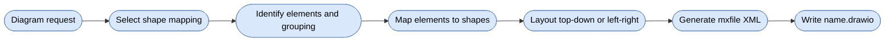

# Drawio Skill

Generates draw.io XML overview diagrams with consistent style and shape mappings for BCE, package-by-layer, and package-by-feature Java architectures, saved as `<name>.drawio`.

## When To Use

Use this skill when the user asks to create, generate, or edit draw.io diagrams, architecture diagrams, component diagrams, or visual overviews of systems and modules. Not for sequence diagrams or class diagrams.

## Workflow

## Shape Mappings

One mapping per diagram, selected from the architecture the user named or the composed skill implies (`sdd4j-bce`, `sdd4j-package-by-layer`, `sdd4j-package-by-feature`, or the architecture `diagrams` detected); the Default mapping covers everything else.

| Mapping | Elements |
|---|---|
| Default | component, grouping container, external |
| BCE | business component, subsystem container, boundary, control, entity, external |
| Package By Layer | capability, layer containers, entrypoint, application, domain, infrastructure, external |
| Package By Feature | feature package, module container, shared package, external |

Colors carry the same meaning across all mappings — and match the `mermaid` skill's palette: blue = capability/component, green = entrypoint/boundary, purple = application/control, yellow = domain/entity, gray = infrastructure/shared, dashed yellow = external.

## Conventions

- Rounded nodes (`arcSize=10`), orthogonal edges, black strokes, block arrows; `dashed=1` for async/optional edges.
- Built-in Jacobson robustness icons (`umlBoundary`, `umlControl`, `umlEntity`) — BCE mapping only, never rebuilt from primitives.
- High-level concepts only: no classes, methods, or implementation details.
- Containers (`container=1;`) for subsystem, layer, or module grouping; 40px node spacing, 20px padding.
- Every file follows the `mxfile > diagram > mxGraphModel > root` hierarchy.

## Bundled References

- [`references/example-bce.drawio`](references/example-bce.drawio) — BCE between-components example
- [`references/example-layered.drawio`](references/example-layered.drawio) — Package By Layer example
- [`references/example-feature.drawio`](references/example-feature.drawio) — Package By Feature example

## Source Contract

See [`SKILL.md`](SKILL.md) for the executable skill instructions, including per-mapping shape tables, the XML skeleton, and a minimal two-node example.
