# Mermaid Skill

Generates Mermaid overview diagrams for architecture and component visualization, with shape and style mappings for BCE, package-by-layer, and package-by-feature Java architectures.

## When To Use

Use this skill when the user asks to create, generate, or draw Mermaid diagrams, architecture overviews, component diagrams, dependency graphs, or system visualizations. Not for sequence diagrams or class diagrams.

## Workflow

```mermaid
graph LR
    Request([Diagram request]) --> Mapping([Select shape mapping])
    Mapping --> Components([Identify high-level components])
    Components --> Subsystems([Group into subgraphs])
    Subsystems --> Shapes([Map elements to shapes])
    Shapes --> Styles([Apply classDef styles])
    Styles --> Output([Write mermaid block to target file])

    classDef comp fill:#dae8fc,stroke:#6c8ebf,color:#000
    class Request,Mapping,Components,Subsystems,Shapes,Styles,Output comp
```



## Shape Mappings

One mapping per diagram, selected from the architecture the user named or the composed skill implies (`sdd4j-bce`, `sdd4j-package-by-layer`, `sdd4j-package-by-feature`, or the architecture `diagrams` detected); the Default mapping covers everything else.

| Mapping | Elements |
|---|---|
| Default | component, subsystem, external |
| BCE | business component, subsystem, boundary, control, entity, external |
| Package By Layer | capability, layer subgraphs, entrypoint, application, domain, infrastructure, external |
| Package By Feature | feature package, module, shared package, external |

Colors carry the same meaning across all mappings: blue = capability/component, green = entrypoint/boundary, purple = application/control, yellow = domain/entity, gray = infrastructure/shared, dashed yellow = external.

## Diagram Conventions

- Prefer `graph` (flowchart) with `TD` or `LR` direction, wrapped in a ` ```mermaid ` fenced code block.
- Stadium-shaped nodes `([text])` with meaningful IDs reflecting component names.
- `-->` for dependencies, `-.->` for optional/async dependencies.
- Label arrows only when ambiguous.
- Subgraphs for logical grouping (subsystems).
- High-level concepts only — omit classes, methods, and implementation details.

## Source Contract

See [`SKILL.md`](SKILL.md) for the executable skill instructions, including per-mapping `classDef` palettes and examples.
