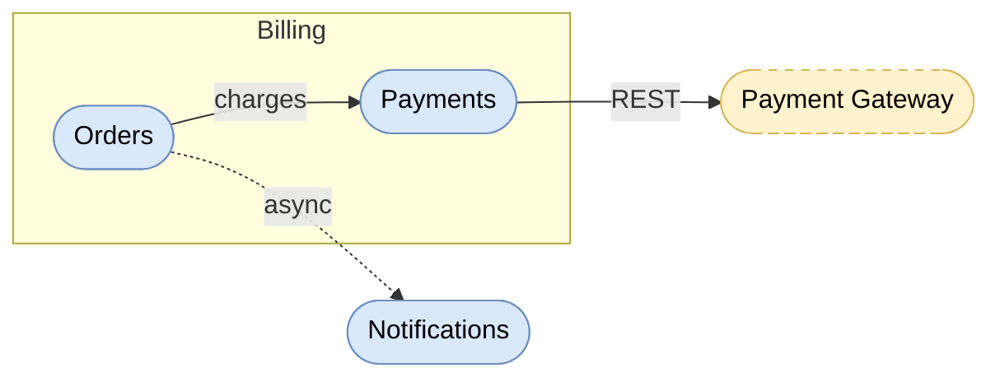
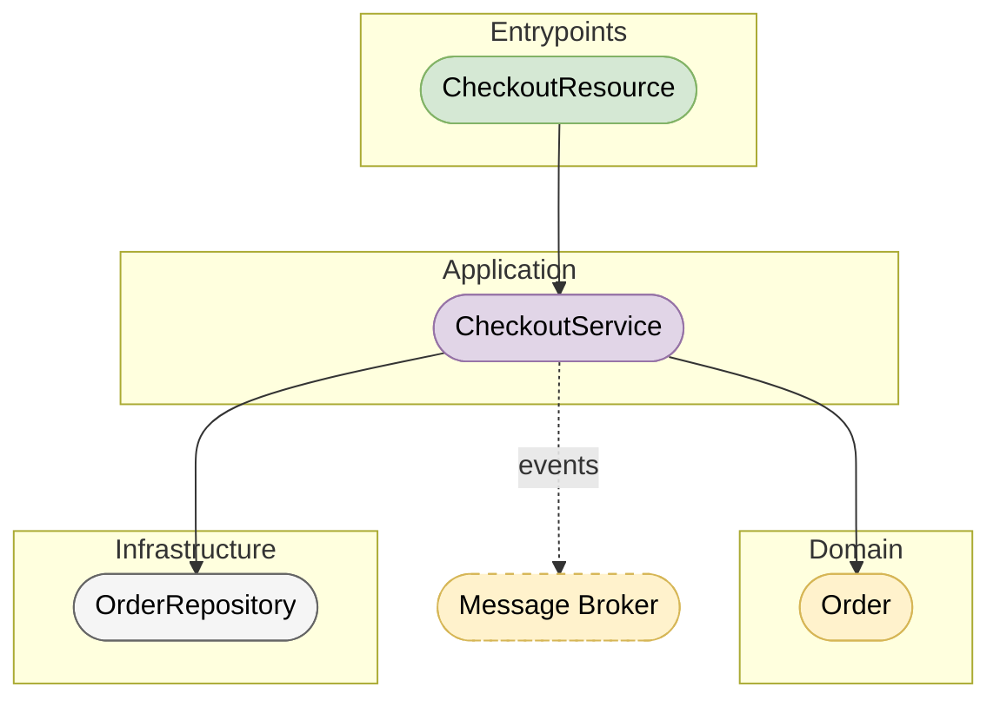
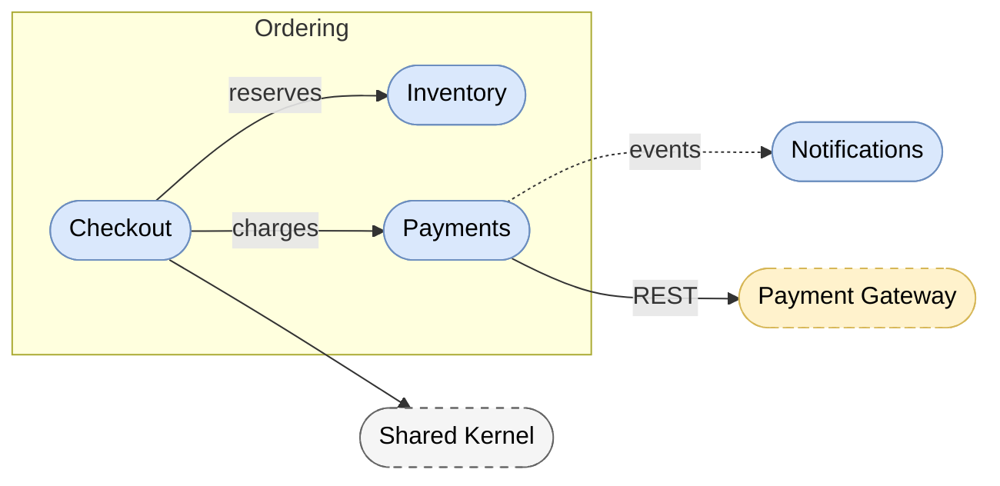

# Mermaid Overview Diagrams

## Rules

- prefer flowchart (graph) with TD or LR direction
- wrap in ` ```mermaid ` fenced code block
- use stadium-shaped nodes: `([text])`
- use meaningful node IDs reflecting component names
- use `-->` for dependencies, `-.->` for optional/async dependencies
- label arrows only when ambiguous: `Gateway -->|routes| Service`
- visualize only high-level concepts — omit classes, methods, implementation details
- use subgraphs for logical grouping (subsystems)
- write diagram into the target file (e.g. README.md) when context is clear

## Mapping Selection

- pick the shape mapping matching the architecture the user named or the composed skill implies:
  - BCE business components, or `sdd4j-bce` in context → BCE mapping
  - technical layer packages, or `sdd4j-package-by-layer` in context → Package By Layer mapping
  - feature/capability packages, or `sdd4j-package-by-feature` in context → Package By Feature mapping
- when invoked via `diagrams`, use the architecture it detected — the router is architecture-neutral
- no clear architecture → use the Default mapping
- never mix mappings inside one diagram

## Palette

Colors carry the same meaning across all mappings:

| Color | Fill | Border | Meaning |
|---|---|---|---|
| Blue | `#dae8fc` | `#6c8ebf` | capability / business component |
| Green | `#d5e8d4` | `#82b366` | entrypoint / boundary |
| Purple | `#e1d5e7` | `#9673a6` | application / control |
| Yellow | `#fff2cc` | `#d6b656` | domain / entity |
| Gray | `#f5f5f5` | `#666666` | infrastructure / shared |
| Dashed yellow | `#fff2cc` | `#d6b656` dashed | external service |

## Default Mapping

Use when no architecture mapping applies.

| Element | Mermaid syntax | Style class |
|---|---|---|
| Component | `Orders([Orders])` | `comp` |
| Subsystem | `subgraph Billing` | — |
| External service | `PayGW([Payment Gateway])` | `ext` |

```
classDef comp fill:#dae8fc,stroke:#6c8ebf,color:#000
classDef ext fill:#fff2cc,stroke:#d6b656,color:#000,stroke-dasharray:5 5
```

## BCE Mapping

| Element | Mermaid syntax | Style class |
|---|---|---|
| Business Component (BC) | `Orders([Orders])` | `bc` |
| Subsystem | `subgraph Billing` | `subsystem` |
| External service | `PayGW([Payment Gateway])` | `ext` |
| Boundary layer | `Boundary([Boundary])` | `boundary` |
| Control layer | `Control([Control])` | `control` |
| Entity layer | `Entity([Entity])` | `entity` |

```
classDef bc fill:#dae8fc,stroke:#6c8ebf,color:#000
classDef ext fill:#fff2cc,stroke:#d6b656,color:#000,stroke-dasharray:5 5
classDef boundary fill:#d5e8d4,stroke:#82b366,color:#000
classDef control fill:#e1d5e7,stroke:#9673a6,color:#000
classDef entity fill:#fff2cc,stroke:#d6b656,color:#000
```

## Package By Layer Mapping

Layers are subgraphs; nodes are the capability's classes inside each layer.

| Element | Mermaid syntax | Style class |
|---|---|---|
| Capability (spec contract) | `Checkout([Checkout])` | `cap` |
| Layer grouping | `subgraph Entrypoints` | — |
| Entrypoint (controller, resource, handler, listener, CLI) | `CheckoutResource([CheckoutResource])` | `entrypoint` |
| Application operation (service, use case) | `CheckoutService([CheckoutService])` | `application` |
| Domain/model type (entity, model, DTO) | `Order([Order])` | `domain` |
| Infrastructure (repository, client, adapter) | `OrderRepository([OrderRepository])` | `infrastructure` |
| External service | `Broker([Message Broker])` | `ext` |

```
classDef cap fill:#dae8fc,stroke:#6c8ebf,color:#000
classDef ext fill:#fff2cc,stroke:#d6b656,color:#000,stroke-dasharray:5 5
classDef entrypoint fill:#d5e8d4,stroke:#82b366,color:#000
classDef application fill:#e1d5e7,stroke:#9673a6,color:#000
classDef domain fill:#fff2cc,stroke:#d6b656,color:#000
classDef infrastructure fill:#f5f5f5,stroke:#666666,color:#000
```

## Package By Feature Mapping

Nodes are feature packages; subgraphs group by module or base package. Drawing inside a feature package reuses the layer classes from the Package By Layer mapping.

| Element | Mermaid syntax | Style class |
|---|---|---|
| Feature package (capability) | `Checkout([Checkout])` | `cap` |
| Module grouping | `subgraph Ordering` | — |
| Shared package (declared exception) | `Shared([Shared Kernel])` | `shared` |
| External service | `PayGW([Payment Gateway])` | `ext` |

```
classDef cap fill:#dae8fc,stroke:#6c8ebf,color:#000
classDef shared fill:#f5f5f5,stroke:#666666,color:#000,stroke-dasharray:5 5
classDef ext fill:#fff2cc,stroke:#d6b656,color:#000,stroke-dasharray:5 5
```

## Example — BCE Between Components



## Example — Package By Layer



## Example — Package By Feature


