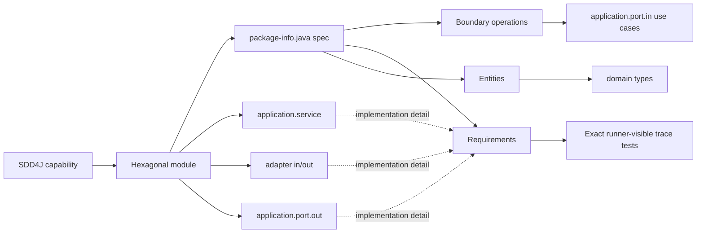

# SDD4J Hexagonal Skill

Maps an SDD4J Java capability spec to a hexagonal (ports and adapters) module.

## When To Use

Use this architecture adapter when a Java project organizes capabilities as hexagonal modules with `domain`, application ports and use cases, and driving/driven `adapter` packages.

Compose it with `sdd4j` for the spec workflow and a Java stack skill for implementation conventions and verification. Use it only when each capability can map to one strict ports-and-adapters module.

## Mapping



## Default Layout

```text
src/main/java/<base>/<capability>/
  package-info.java
  domain/
  application/
    port/in/
    port/out/
    service/
  adapter/
    in/
    out/

src/test/java/<base>/<capability>/
```

## Core Rules

- One SDD4J capability maps to one hexagonal module package.
- `## Boundary` maps only to inbound port operations (`application.port.in`).
- `## Entities` maps to contract-relevant types in `domain`.
- `application.service`, `application.port.out`, and `adapter` are implementation detail and have no spec section.
- Dependencies point inward: domain never depends on ports, adapters, or frameworks; structural violations are drift.
- Requirement ids must resolve to exact runner-visible test identities through literal ids or resolvable symbols according to the stack convention; JavaDoc and comments alone do not count.
- Public port operations, contract-relevant domain types, or test traces without spec counterparts are reported as inverse drift.
- Cross-module calls, events, shared nouns, and system invariants belong in the system package doc or project architecture documentation.
- Do not mix hexagonal, feature-package, layered, and BCE adapters inside one capability.

## Source Contract

See [`SKILL.md`](SKILL.md) for the executable skill instructions.
